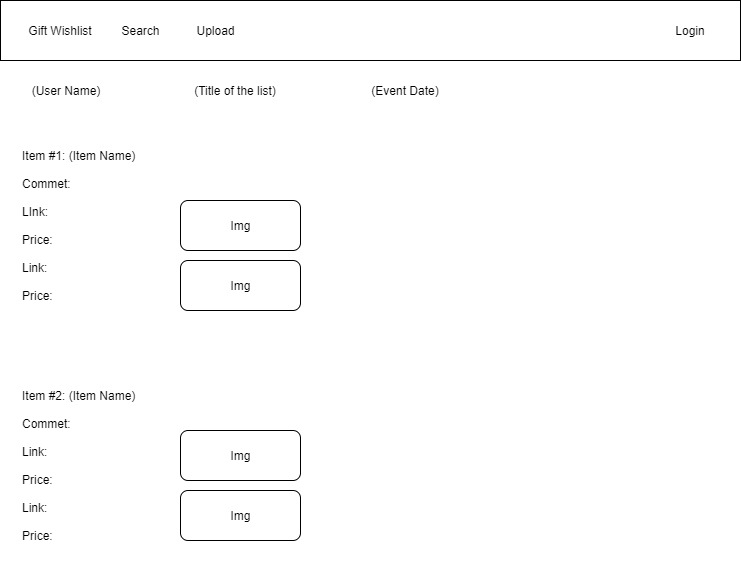

# Gift Wishlist

### What it does:
Gift Wishlist allows users to input their wishlist items they want for the upcoming event such as birthday. They can share it to the public so others can view.

### How it works:
Users log into the website and it allows them to input the gift wishlist they want for the upcoming event. The list of items will store in the database and it will compare prices from different online stores for the buyer to get the best price.

### Technologies:
* HTML
* CSS
* Javascript
* Bootstrap
* jQuery
* Node.js
* Express.js
* MongoDB
* Mongoose ORM
* User authentication
* dotenv
* AJAX
* Heroku
* mLab

### Website Wireframe

### Member:
* Daniel Chiu - Full-Stack
